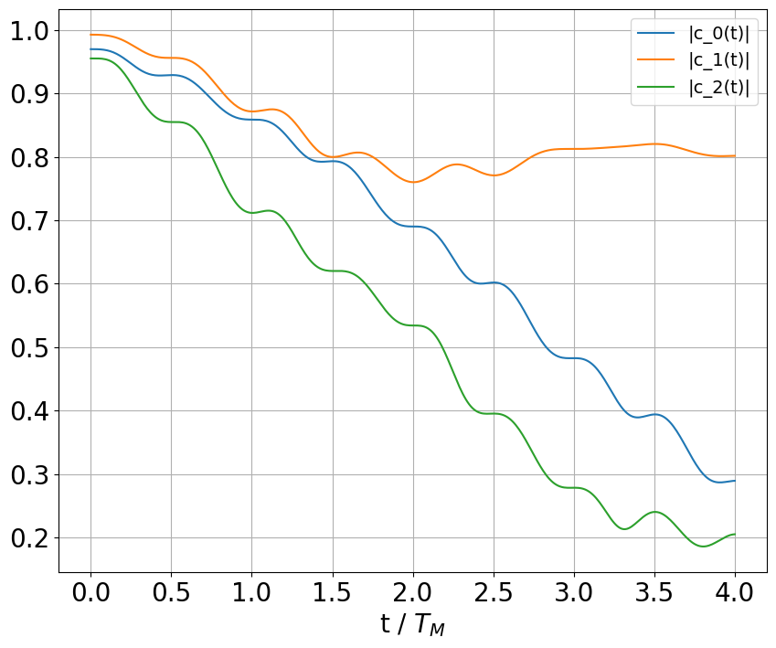
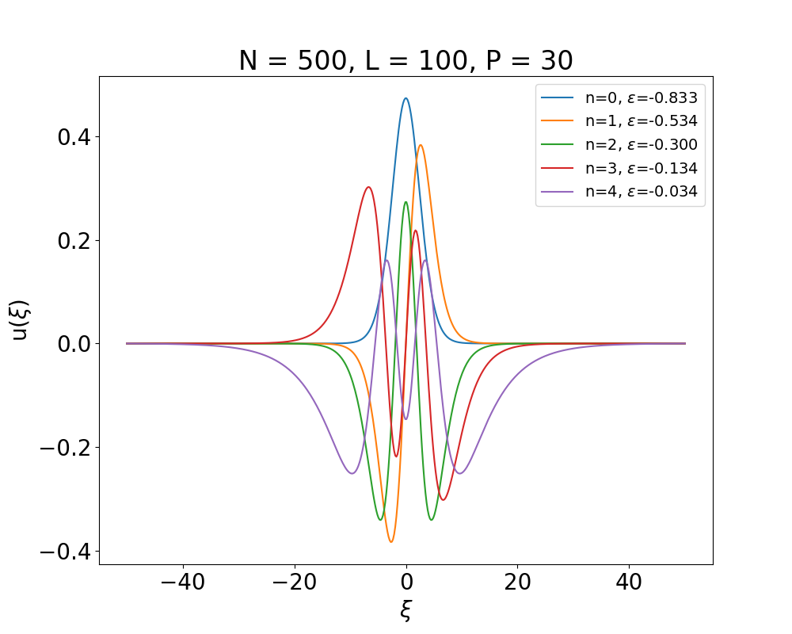
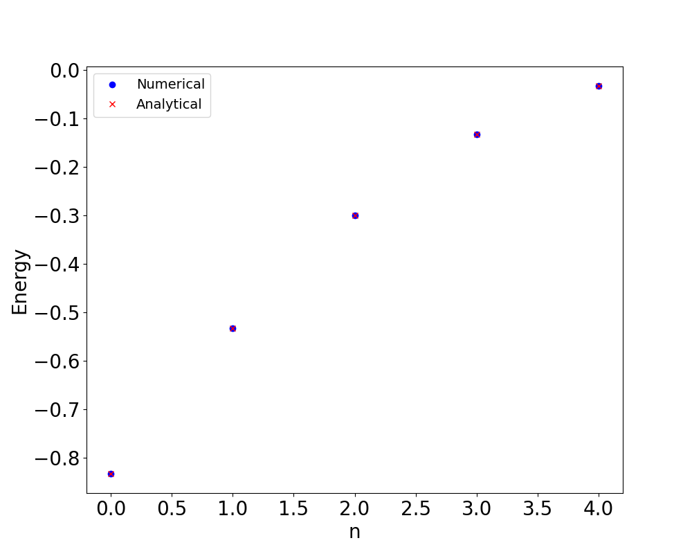

# Quantum System Dynamics: Numerical Solutions to the Schrödinger Equation


## Overview
This repository computationally models the energy eigenstates and time evolution of a 1D quantum system. It utilizes dimensional analysis and numerical techniques to solve both the stationary (TISE) and time-dependent Schrödinger equations (TDSE) for a particle in a localized potential well (Pöschl-Teller style). 

This project bridges theoretical quantum mechanics with applied computational physics, demonstrating the use of finite difference methods, matrix operations, and numerical integration to visualize complex quantum phenomena.

## Key Features & Physics
* **Stationary State Calculation (`Functions.py`):** * Constructs the Hamiltonian matrix using finite difference methods.
  * Numerically solves for bound state energies and normalized wavefunctions.
  * Validates numerical models by comparing them directly against analytical energy solutions.
* **Time Dynamics (`Functions.py` & `Plots.py`):** * Implements the **Crank-Nicholson Method** to simulate the time evolution of the system.
  * Models quantum systems under a time-dependent, modulated oscillating potential ($V(x, t)$).
  * Tracks and plots transition probabilities (via projection coefficients $|c_0(t)|$, $|c_1(t)|$, $|c_2(t)|$) to observe state transitions over time.
* **Scalable Grid Generation (`Grid.py`):** Provides modular spatial discretization for flexible computational domains.

## Results Showcase

Below are select visualizations generated by the numerical models:

### 1. Quantum State Transitions under Modulated Potential

> **Figure 1:** Time evolution of the projection coefficients $|c_n(t)|$ under a modulated potential ($\eta = 0.5$). The oscillations demonstrate the shifting probabilities of the particle occupying states $n=0, 1,$ or $2$ over time.

### 2. Localized Energy Eigenstates

> **Figure 2:** The first five normalized bound state wavefunctions calculated for the localized potential well.

### 3. Analytical vs. Numerical Accuracy

> **Figure 3:** Direct comparison showing high fidelity between the numerically computed eigenvalues and the analytical localized energies.

## Repository Structure

```text
Quantum-Time-Evolution/
│
├── README.md                    <- Project documentation
├── requirements.txt             <- List of required Python packages
├── .gitignore                   <- Standard Python gitignore
├── LICENSE                      <- MIT License
│
├── src/                         <- Source code modules
│   ├── Functions.py             <- Core physics, matrix, and Crank-Nicholson logic
│   ├── Grid.py                  <- Spatial grid initialization
│   └── Plots.py                 <- Main execution script for visualizations
│
└── assets/                      <- Generated data visualizations and plots
    ├── Plot1_N100_L10_P30.png
    ├── Plot6_N500_L100_P30.png
    ├── Plot10_Time_Evolution_Modulated_Potential_eta_0.5.png
    └── ...
